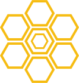

# Swarmion

  

<!-- ALL-CONTRIBUTORS-BADGE:START - Do not remove or modify this section -->

<!-- ALL-CONTRIBUTORS-BADGE:END -->

A set of tools to build and deploy type-safe microservices. In order to see working examples of these tools, check out the [examples folder](https://github.com/swarmion/swarmion/tree/main/examples).

This project is composed of the following packages:

- [@swarmion/serverless-contracts](./packages/serverless-contracts): generate and use type-safe contracts in your Serverless microservices ([view on npm](https://www.npmjs.com/package/@swarmion/serverless-contracts))
- [@swarmion/serverless-plugin](./packages/serverless-contracts-plugin): a Serverless plugin to safely deploy microservices ([view on npm](https://www.npmjs.com/package/@swarmion/serverless-plugin))
- [@swarmion/eslint-plugin](./packages/eslint-plugin): an eslint plugin with rules to enforces proper usage of contracts ([view on npm](https://www.npmjs.com/package/@swarmion/eslint-plugin))
- [@swarmion/nx-plugin](./packages/nx-plugin): an Nx plugin to simplify modules generation ([view on npm](https://www.npmjs.com/package/@swarmion/nx-plugin))
- [@swarmion/serverless-cdk-plugin](./packages/serverless-cdk-plugin): a Serverless plugin to deploy CDK constructs ([view on npm](https://www.npmjs.com/package/@swarmion/serverless-cdk-plugin))

## User Documentation

Swarmion user documentation lives in [the user docs folder](./user-docs/documentation/README.md). It is deployed and accessible on <https://www.swarmion.dev>.

## Contributors ✨

Thanks goes to these wonderful people ([emoji key](https://allcontributors.org/docs/en/emoji-key)):

<!-- ALL-CONTRIBUTORS-LIST:START - Do not remove or modify this section -->
<!-- prettier-ignore-start -->
<!-- markdownlint-disable -->
<table>
  <tbody>
    <tr>
      <td align="center" valign="top" width="14.28%"><a href="https://github.com/fargito"> <b>François Farge</b></a> <a href="https://github.com/swarmion/swarmion/commits?author=fargito" title="Code">💻</a> <a href="#ideas-fargito" title="Ideas, Planning, & Feedback">🤔</a> <a href="https://github.com/swarmion/swarmion/commits?author=fargito" title="Documentation">📖</a> <a href="#infra-fargito" title="Infrastructure (Hosting, Build-Tools, etc)">🚇</a></td>
      <td align="center" valign="top" width="14.28%"><a href="https://github.com/adriencaccia"> <b>Adrien Cacciaguerra</b></a> <a href="https://github.com/swarmion/swarmion/commits?author=adriencaccia" title="Code">💻</a> <a href="#ideas-adriencaccia" title="Ideas, Planning, & Feedback">🤔</a> <a href="#infra-adriencaccia" title="Infrastructure (Hosting, Build-Tools, etc)">🚇</a> <a href="https://github.com/swarmion/swarmion/commits?author=adriencaccia" title="Documentation">📖</a></td>
      <td align="center" valign="top" width="14.28%"><a href="https://github.com/MaximeVivier"> <b>Maxime Vivier</b></a> <a href="https://github.com/swarmion/swarmion/commits?author=MaximeVivier" title="Code">💻</a></td>
      <td align="center" valign="top" width="14.28%"><a href="https://github.com/GuillaumeLagrange"> <b>Guillaume Lagrange</b></a> <a href="https://github.com/swarmion/swarmion/commits?author=GuillaumeLagrange" title="Code">💻</a> <a href="https://github.com/swarmion/swarmion/commits?author=GuillaumeLagrange" title="Documentation">📖</a></td>
      <td align="center" valign="top" width="14.28%"><a href="https://github.com/Sc0ra"> <b>Axel Fournier</b></a> <a href="https://github.com/swarmion/swarmion/commits?author=Sc0ra" title="Code">💻</a> <a href="https://github.com/swarmion/swarmion/commits?author=Sc0ra" title="Documentation">📖</a> <a href="#ideas-Sc0ra" title="Ideas, Planning, & Feedback">🤔</a></td>
      <td align="center" valign="top" width="14.28%"><a href="https://github.com/guillaumeduboc"> <b>guillaumeduboc</b></a> <a href="https://github.com/swarmion/swarmion/commits?author=guillaumeduboc" title="Code">💻</a> <a href="https://github.com/swarmion/swarmion/commits?author=guillaumeduboc" title="Documentation">📖</a></td>
      <td align="center" valign="top" width="14.28%"><a href="https://github.com/Eikix"> <b>Elias Tazartes</b></a> <a href="https://github.com/swarmion/swarmion/commits?author=Eikix" title="Code">💻</a></td>
    </tr>
    <tr>
      <td align="center" valign="top" width="14.28%"><a href="https://github.com/ealain"> <b>Éloi Alain</b></a> <a href="https://github.com/swarmion/swarmion/commits?author=ealain" title="Documentation">📖</a></td>
      <td align="center" valign="top" width="14.28%"><a href="https://corentindoue.github.io"> <b>Corentin Doue</b></a> <a href="https://github.com/swarmion/swarmion/commits?author=CorentinDoue" title="Code">💻</a> <a href="https://github.com/swarmion/swarmion/commits?author=CorentinDoue" title="Documentation">📖</a></td>
      <td align="center" valign="top" width="14.28%"><a href="https://github.com/LouisPinsard"> <b>Louis Pinsard</b></a> <a href="https://github.com/swarmion/swarmion/commits?author=LouisPinsard" title="Code">💻</a></td>
      <td align="center" valign="top" width="14.28%"><a href="https://github.com/pmilliotte"> <b>Pierre Milliotte</b></a> <a href="https://github.com/swarmion/swarmion/commits?author=pmilliotte" title="Code">💻</a></td>
      <td align="center" valign="top" width="14.28%"><a href="https://github.com/ThomasAribart"> <b>Thomas Aribart</b></a> <a href="https://github.com/swarmion/swarmion/commits?author=ThomasAribart" title="Documentation">📖</a></td>
      <td align="center" valign="top" width="14.28%"><a href="https://github.com/charlesgery"> <b>Charles Géry</b></a> <a href="https://github.com/swarmion/swarmion/commits?author=charlesgery" title="Code">💻</a></td>
      <td align="center" valign="top" width="14.28%"><a href="https://github.com/StanHannebelle"> <b>Stan Hannebelle</b></a> <a href="https://github.com/swarmion/swarmion/commits?author=StanHannebelle" title="Code">💻</a></td>
    </tr>
    <tr>
      <td align="center" valign="top" width="14.28%"><a href="https://github.com/qhello"> <b>Quentin Hello</b></a> <a href="#infra-qhello" title="Infrastructure (Hosting, Build-Tools, etc)">🚇</a> <a href="https://github.com/swarmion/swarmion/commits?author=qhello" title="Documentation">📖</a></td>
      <td align="center" valign="top" width="14.28%"><a href="https://github.com/Paulmolin"> <b>Paul Molin</b></a> <a href="https://github.com/swarmion/swarmion/commits?author=Paulmolin" title="Code">💻</a></td>
      <td align="center" valign="top" width="14.28%"><a href="https://github.com/Thomasprelot"> <b>Thomas Prelot</b></a> <a href="https://github.com/swarmion/swarmion/commits?author=Thomasprelot" title="Code">💻</a></td>
      <td align="center" valign="top" width="14.28%"><a href="https://github.com/art049"> <b>Arthur Pastel</b></a> <a href="https://github.com/swarmion/swarmion/commits?author=art049" title="Documentation">📖</a></td>
      <td align="center" valign="top" width="14.28%"><a href="https://github.com/Yoctoboy"> <b>Alexis Reymann</b></a> <a href="https://github.com/swarmion/swarmion/commits?author=Yoctoboy" title="Documentation">📖</a> <a href="https://github.com/swarmion/swarmion/commits?author=Yoctoboy" title="Code">💻</a></td>
      <td align="center" valign="top" width="14.28%"><a href="https://github.com/bchangal"> <b>Carton</b></a> <a href="https://github.com/swarmion/swarmion/commits?author=bchangal" title="Code">💻</a></td>
      <td align="center" valign="top" width="14.28%"><a href="https://www.linkedin.com/in/pchol22/"> <b>Pierre Chollet</b></a> <a href="https://github.com/swarmion/swarmion/commits?author=PChol22" title="Code">💻</a></td>
    </tr>
    <tr>
      <td align="center" valign="top" width="14.28%"><a href="https://github.com/adelego"> <b>Adèle Gauvrit</b></a> <a href="https://github.com/swarmion/swarmion/commits?author=adelego" title="Code">💻</a></td>
      <td align="center" valign="top" width="14.28%"><a href="https://github.com/clementmarcilhacy"> <b>Clément Marcilhacy</b></a> <a href="https://github.com/swarmion/swarmion/commits?author=clementmarcilhacy" title="Code">💻</a> <a href="https://github.com/swarmion/swarmion/commits?author=clementmarcilhacy" title="Documentation">📖</a></td>
      <td align="center" valign="top" width="14.28%"><a href="https://dev.to/valentinbeggi"> <b>Valentin Beggi</b></a> <a href="https://github.com/swarmion/swarmion/commits?author=valentinbeggi" title="Code">💻</a></td>
      <td align="center" valign="top" width="14.28%"><a href="https://github.com/SashankBhamidi"> <b>Sashank</b></a> <a href="https://github.com/swarmion/swarmion/commits?author=SashankBhamidi" title="Code">💻</a></td>
    </tr>
  </tbody>
</table>

<!-- markdownlint-restore -->
<!-- prettier-ignore-end -->

<!-- ALL-CONTRIBUTORS-LIST:END -->

This project follows the [all-contributors](https://github.com/all-contributors/all-contributors) specification. Contributions of any kind welcome!

<a href="https://www.flaticon.com/" title="icons">Icons created by Smashicons - Flaticon</a>

## Sponsor

Swarmion is sponsored by [Theodo](https://www.theodo.fr/).

  

> Our Paris, London & New York teams of full-stack developers and agile experts bring together the tech, the talent and the experience to develop your web, mobile and software applications in record time.
