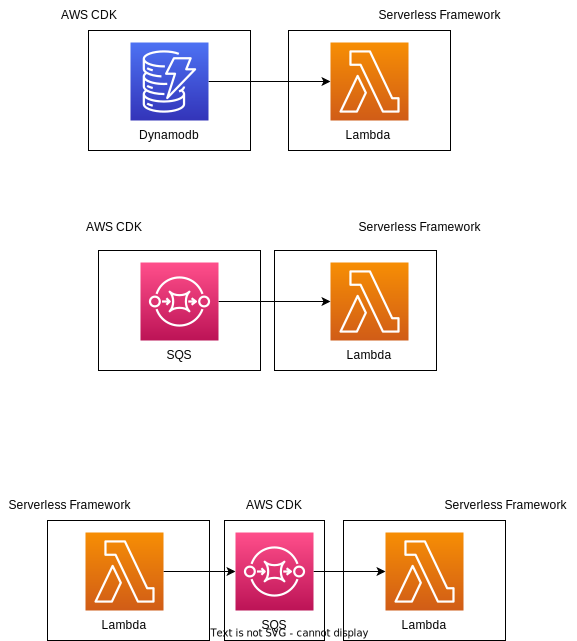

# :sparkles: :rocket: Serverless CDK Bridge Plugin :rocket: :sparkles:

> _Provision resources using the AWS CDK (SQS, Dynamodb, etc.) and reference them in the Serverless framework (lambdas and configuration's `serverless.ts`)._

## :muscle: Motivation :muscle:

When using Serverless framework along with AWS, one often runs into needing to provision resources that aren't covered by the framework (e.g. SQS, DynamoDB). This problem can be solved using AWS Cloudformation, or AWS CDK, among many other options.

1. The main resulting issue is the following: How can one reference the resources created outside of Serverless framework?

2. Moreover, how does one reference lambdas provisioned in the Serverless framework lifecycle inside their custom resources?

These two challenges motivated the development of the Serverless-CDK Bridge.

## :gift: DX Gains :gift:

- Developers that were using Cloudformation to provision resources that Serverless Framework does not manage can now use the AWS CDK. It is a more efficient and DX-friendly option.

- Developers that were using the AWS CDK won't need to "transpile" their CDK constructs' code into Cloudformation before the Serverless Framework deploy step. This saves them a lot of boilerplate fatigue.

## :raised_hands: Caveats :raised_hands:

- The Serverless CDK bridge plugin is only available for Serverless framework Typescript users, as it relies on the existence of a `serverless.ts` file at the root of any service to function.

---

### Use-case examples



#### Code example:

Here's a short code snippet to demonstrate how to use the plugin.

backend orchestrator > resources > dynamodb.ts

```ts
import type { ServerlessProps } from '@swarmion/serverless-cdk-plugin';
import ServerlessCdkPlugin from '@swarmion/serverless-cdk-plugin';

import { PARTITION_KEY, SORT_KEY } from 'libs/dynamodb/primaryKeys';

export class OrchestratorDynamodb extends ServerlessCdkPlugin.ServerlessConstruct {
  public dynamodbArn: string;
  public dynamodbName: string;

  constructor(scope: Construct, id: string, serverlessProps: ServerlessProps) {
    super(scope, id, serverlessProps);

    const table = new Table(this, 'OrchestratorTable', {
      partitionKey: { name: PARTITION_KEY, type: AttributeType.STRING },
      sortKey: { name: SORT_KEY, type: AttributeType.STRING },
      billingMode: BillingMode.PAY_PER_REQUEST,
    });

    this.dynamodbArn = table.tableArn;
    this.dynamodbName = table.tableName;
  }
}

export const getCdkProperty =
  ServerlessCdkPlugin.getCdkPropertyHelper<OrchestratorDynamodb>;
```

Then, pass the construct to the `serverless.ts` file at the serverlessConstruct key:

backend orchestrator > serverless.ts

```ts
const serverlessConfiguration: AWS &
  ServerlessContracts &
  ServerlessCdkPluginConfig = {
  // Other properties ...
  construct: OrchestratorDynamodb,
  params: sharedParams,
  provider: {
    ...sharedProviderConfig,
  },
};
```

And that's it! Constructs (e.g. dynamodb table) can now be referenced in the Serverless framework code seamlessly (e.g. within lambdas configuration files).

backend orchestrator > functions > requestSyncDeployment > config.ts

```ts
import { requestSyncDeployment } from '@swarmion/orchestrator-contracts';
import { getTrigger } from '@swarmion/serverless-contracts';
import { getHandlerPath, LambdaFunction } from '@swarmion/serverless-helpers';

import { getCdkProperty } from 'resources/dynamodb';

const config: LambdaFunction = {
  environment: {
    ORCHESTRATOR_TABLE_NAME: getCdkProperty('dynamodbName'),
  },
  handler: getHandlerPath(__dirname),
  iamRoleStatements: [
    {
      Effect: 'Allow',
      Resource: getCdkProperty('dynamodbArn'),
      Action: ['dynamodb:PutItem'],
    },
  ],
  iamRoleStatementsInherit: true,
  events: [getTrigger(requestSyncDeployment)],
};

export default config;
```
